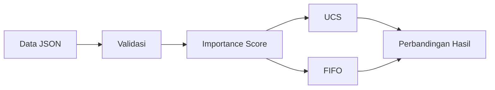

# Sistem Pendukung Keputusan Berbasis AI untuk Prioritisasi dan Penanganan Insiden Jaringan Kampus

> Prototype Milestone 1 untuk membantu administrator jaringan menentukan
> insiden yang sebaiknya ditangani lebih dahulu.

Proyek ini dibuat sebagai proyek akhir mata kuliah Kecerdasan Buatan (10S3001),
Program Studi Sarjana Sistem Informasi, Institut Teknologi Del.

## Tentang Proyek

Ketika beberapa gangguan jaringan terjadi bersamaan, urutan laporan masuk belum
tentu menjadi urutan penanganan terbaik. Setiap insiden dapat memiliki urgensi,
dampak, jumlah pengguna terdampak, dan waktu penanganan yang berbeda.

Sistem ini menilai setiap insiden, mencari urutan penanganan dengan total
penalti terendah, lalu membandingkannya dengan antrean FIFO non-search. Hasilnya berupa
**rekomendasi**, bukan keputusan otomatis.

## Anggota Tim

| No. | Nama |
|---:|---|
| 1 | Rony Reynaldy Pangaribuan |
| 2 | Doydenggan Simanjuntak |
| 3 | Indah Nainggolan |

## Gambaran Cepat

| Bagian | Keterangan |
|---|---|
| Baseline Search Milestone 1 | Uniform Cost Search (UCS) |
| Metode pembanding tambahan | First In, First Out (FIFO), non-search |
| Input | Satu batch data insiden sintetis dalam JSON |
| Output | Rekomendasi urutan, rincian biaya, dan perbandingan |
| Teknologi | Python 3.11 dan Astral `uv` |
| Lisensi | MIT |
| Status | Milestone 1 |

UCS dipilih karena seluruh biaya langkah nonnegatif dan algoritma ini dapat
menemukan solusi optimal tanpa heuristic. A* tidak diimplementasikan pada
Milestone 1.

## Apa yang Dilakukan Sistem?

1. Membaca dan memvalidasi data insiden.
2. Menghitung *importance score* setiap insiden.
3. Mencari urutan optimal menggunakan UCS.
4. Membentuk urutan FIFO sebagai pembanding.
5. Menampilkan alasan prioritas dan perbandingan biaya.



## Mulai Cepat

### 1. Siapkan proyek

```bash
git clone https://github.com/RonyPangaribuan/Proyek-Certan.git
cd Proyek-Certan
uv sync
```

### 2. Jalankan aplikasi

```bash
uv run proyek-certan --input data/sample_incidents.json
```

Alternatif:

```bash
uv run python -m proyek_certan --input data/sample_incidents.json
```

### 3. Jalankan pengujian

```bash
uv run pytest -v
```

Jika launcher `pytest` diblokir oleh kebijakan Windows:

```bash
uv run python -m pytest -v
```

## Contoh Hasil

Data contoh menghasilkan perbandingan berikut:

| Metode | Weighted-minute penalty |
|---|---:|
| UCS | 1412.5903 |
| FIFO | 1531.3458 |

- Selisih biaya: **118.7556**
- Pengurangan biaya: **7.75%**
- State UCS yang diperluas: **4095**

Urutan rekomendasi UCS:

```text
INC011 → INC006 → INC004 → INC003 → INC002 → INC008
→ INC010 → INC005 → INC007 → INC001 → INC012 → INC009
```

CLI menampilkan rincian lengkap untuk setiap insiden, termasuk *importance
score*, waktu selesai, step cost, total cost, dan statistik pencarian.

## Detail Teknis

<details>
<summary><strong>Format data input</strong></summary>

Input berupa array JSON nonkosong. Setiap insiden memiliki sembilan atribut:

| Atribut | Aturan |
|---|---|
| `incident_id` | string unik dengan format `INCxxx` |
| `category` | string nonkosong |
| `location` | string nonkosong |
| `urgency` | integer 1–5 |
| `impact` | integer 1–5 |
| `affected_users` | integer ≥ 0 |
| `service_criticality` | integer 1–5 |
| `waiting_time_min` | integer ≥ 0 |
| `estimated_handling_time_min` | integer > 0 |

Contoh:

```json
[
  {
    "incident_id": "INC001",
    "category": "wifi_slow",
    "location": "Ruang Kelas",
    "urgency": 2,
    "impact": 2,
    "affected_users": 15,
    "service_criticality": 2,
    "waiting_time_min": 35,
    "estimated_handling_time_min": 20
  }
]
```

</details>

<details>
<summary><strong>Importance score dan bobot</strong></summary>

Normalisasi dilakukan terhadap batch yang sedang diproses:

```text
normalized_urgency     = urgency / 5
normalized_impact      = impact / 5
normalized_criticality = service_criticality / 5
normalized_users       = affected_users / max_affected_users
normalized_waiting     = waiting_time_min / max_waiting_time
```

Jika maksimum jumlah pengguna atau waktu tunggu adalah nol, nilai normalisasi
komponen tersebut menjadi nol.

| Komponen | Bobot |
|---|---:|
| Urgency | 0.30 |
| Impact | 0.25 |
| Service criticality | 0.20 |
| Affected users | 0.15 |
| Waiting time | 0.10 |

```text
importance_score =
    0.30 × normalized_urgency
  + 0.25 × normalized_impact
  + 0.20 × normalized_criticality
  + 0.15 × normalized_users
  + 0.10 × normalized_waiting
```

Bobot dapat dikonfigurasi, tetapi harus nonnegatif dan berjumlah `1.0`. Bobot
baseline ini belum dikalibrasi menggunakan data operasional.

Waktu tunggu menjadi mekanisme *aging* agar laporan lama tidak terus tertunda.
`category` dan `location` hanya digunakan sebagai konteks.

</details>

<details>
<summary><strong>Perhitungan path cost</strong></summary>

```text
completion_time = elapsed_time + estimated_handling_time
step_cost       = importance_score × completion_time
total_cost      = Σ step_cost
```

UCS mencari urutan dengan `total_cost` minimum. Nilai ini merupakan
*weighted-minute penalty*, bukan biaya finansial. FIFO memakai fungsi biaya yang
sama hanya sebagai metode pembanding agar hasil keduanya dapat dievaluasi secara
adil.

</details>

<details>
<summary><strong>Mengubah bobot melalui CLI</strong></summary>

```bash
uv run proyek-certan \
  --input data/sample_incidents.json \
  --weight-urgency 0.35 \
  --weight-impact 0.25 \
  --weight-service-criticality 0.20 \
  --weight-affected-users 0.10 \
  --weight-waiting-time 0.10
```

</details>

<details>
<summary><strong>Struktur direktori</strong></summary>

```text
data/
└── sample_incidents.json
docs/milestone-1/
src/proyek_certan/
├── __init__.py
├── __main__.py
├── cli.py
├── io.py
├── models.py
├── scoring.py
├── validation.py
├── baselines/
│   └── fifo.py
└── search/
    └── ucs.py
tests/
├── test_cli.py
├── test_fifo.py
├── test_models.py
├── test_scoring.py
└── test_ucs.py
```

</details>

## Batasan

- Data bersifat sintetis dan tidak menggambarkan kondisi jaringan kampus
  tertentu.
- Sistem memproses satu snapshot dalam satu antrean berurutan.
- UCS ditujukan untuk batch prototype kecil karena pertumbuhan state-nya
  eksponensial.
- Sistem tidak melakukan monitoring, diagnosis, troubleshooting, penugasan
  teknisi, atau perbaikan jaringan.
- Keputusan akhir tetap berada pada administrator jaringan.
