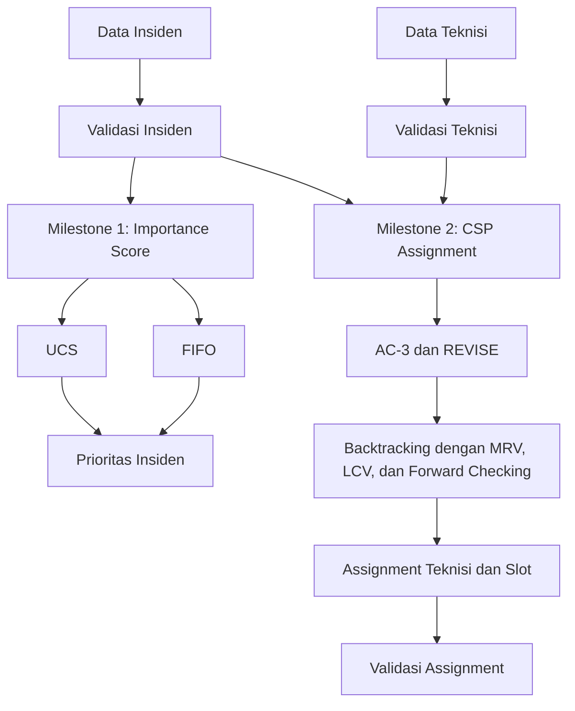

# Sistem Pendukung Keputusan Berbasis AI untuk Prioritisasi dan Penanganan Insiden Jaringan Kampus

> Prototype akademik untuk memprioritaskan insiden jaringan serta menentukan
> penugasan teknisi dan slot waktu yang memenuhi constraint.

Proyek ini dikembangkan sebagai proyek akhir mata kuliah Kecerdasan Buatan
(10S3001), Program Studi Sarjana Sistem Informasi, Institut Teknologi Del. Data
yang digunakan masih sintetis. Hasil sistem merupakan rekomendasi dan
assignment yang layak, sedangkan keputusan akhir tetap berada pada
administrator jaringan.

## Tentang Proyek

Ketika beberapa gangguan jaringan terjadi bersamaan, urutan laporan masuk belum
tentu menjadi urutan penanganan yang tepat. Setiap insiden dapat memiliki
urgensi, dampak, jumlah pengguna terdampak, waktu tunggu, kebutuhan skill, dan
waktu penanganan yang berbeda. Ketersediaan teknisi dan slot waktu juga perlu
diperhitungkan.

Repository ini mencakup dua milestone:

- **Milestone 1 - Prioritisasi insiden.** Sistem menghitung *importance score*,
  mencari urutan penanganan dengan Uniform Cost Search (UCS), dan
  membandingkannya dengan FIFO sebagai baseline non-search. Milestone ini
  menjawab pertanyaan: "Insiden mana yang perlu ditangani lebih dahulu?"
- **Milestone 2 - Penugasan teknisi dan slot.** Sistem memodelkan penugasan
  sebagai Constraint Satisfaction Problem (CSP), mengurangi domain dengan
  AC-3, lalu mencari assignment lengkap dan konsisten dengan Backtracking,
  Minimum Remaining Values (MRV), Least Constraining Value (LCV), dan Forward
  Checking. Milestone ini menjawab pertanyaan: "Teknisi mana dan slot waktu
  mana yang dapat digunakan untuk menangani insiden secara valid?"

Hubungan kedua milestone bersifat konseptual: Milestone 1 memberikan konteks
prioritas insiden, sedangkan Milestone 2 menangani kelayakan penugasan teknisi
dan slot. Implementasi saat ini tidak memasukkan hasil UCS atau *importance
score* sebagai constraint maupun objective CSP.


```mermaid
flowchart TD
    A[Data Insiden] --> B[Validasi Insiden]
    B --> C[Milestone 1: Importance Score]
    C --> D[UCS]
    C --> E[FIFO]
    D --> F[Prioritas Insiden]
    E --> F

    B --> G[Milestone 2: CSP Assignment]
    H[Data Teknisi] --> I[Validasi Teknisi]
    I --> G
    G --> J[AC-3 dan REVISE]
    J --> K[Backtracking dengan MRV, LCV, dan Forward Checking]
    K --> L[Assignment Teknisi dan Slot]
    L --> M[Validasi Assignment]
```

## Anggota Tim

| No. | Nama |
|---:|---|
| 1 | Rony Reynaldy Pangaribuan |
| 2 | Doydenggan Simanjuntak |
| 3 | Indah Nainggolan |

## Gambaran Cepat

| Bagian | Keterangan |
|---|---|
| Milestone 1 | Prioritisasi insiden |
| Search Milestone 1 | Uniform Cost Search (UCS) |
| Baseline Milestone 1 | First In, First Out (FIFO), non-search |
| Milestone 2 | Penugasan teknisi dan slot berbasis CSP |
| Constraint Propagation | AC-3 dan REVISE |
| Search Milestone 2 | Backtracking |
| Heuristik | MRV dan LCV |
| Pruning saat pencarian | Forward Checking |
| Data | Insiden dan teknisi sintetis dalam JSON |
| Teknologi | Python 3.11 dan Astral `uv` |
| Lisensi | MIT |
| Status | Milestone 2 completed |

UCS dipilih pada Milestone 1 karena seluruh biaya langkah nonnegatif dan dapat
menemukan urutan dengan *weighted-minute penalty* minimum tanpa heuristic. A*
tidak diimplementasikan. Solver CSP Milestone 2 mencari solusi yang valid dan
feasible; solver tersebut tidak memiliki objective function.

## Apa yang Dilakukan Sistem?

1. Membaca dan memvalidasi data insiden.
2. Menghitung *importance score* setiap insiden.
3. Membentuk urutan prioritas menggunakan UCS.
4. Membentuk urutan FIFO sebagai baseline pembanding.
5. Membaca dan memvalidasi data teknisi.
6. Membentuk CSP penugasan teknisi dan slot.
7. Membentuk domain berdasarkan kecocokan skill dan availability teknisi.
8. Menjalankan AC-3 dan REVISE untuk memastikan konsistensi arc.
9. Menjalankan Backtracking dengan MRV, LCV, dan Forward Checking.
10. Memvalidasi assignment akhir agar lengkap dan konsisten.

Langkah Milestone 1 dan Milestone 2 tersedia dalam implementasi masing-masing;
urutan prioritas UCS belum diteruskan secara otomatis ke solver CSP.

## Mulai Cepat

### 1. Siapkan proyek

```bash
git clone https://github.com/RonyPangaribuan/Proyek-Certan.git
cd Proyek-Certan
uv sync
```

### 2. Jalankan Milestone 1

```bash
uv run proyek-certan --input data/sample_incidents.json
```

Alternatif:

```bash
uv run python -m proyek_certan --input data/sample_incidents.json
```

### 3. Jalankan Milestone 2

```bash
uv run python -m proyek_certan.constraint_solver.assignment_cli \
  --incidents data/sample_incidents.json \
  --technicians data/sample_technicians.json
```

### 4. Jalankan sensitivity benchmark

```bash
uv run python -m proyek_certan.constraint_solver.benchmark --runs 10
```

Benchmark juga dapat menyimpan hasil eksperimen ke CSV:

```bash
uv run python -m proyek_certan.constraint_solver.benchmark \
  --runs 10 \
  --csv benchmark_results.csv
```

### 5. Jalankan pengujian

```bash
uv run python -m pytest -v
```

## Hasil Milestone 1

Data contoh menghasilkan perbandingan berikut:

| Metode | Weighted-minute penalty |
|---|---:|
| UCS | 1412.5903 |
| FIFO | 1531.3458 |

- Selisih biaya: **118.7556**
- Pengurangan biaya: **7.75%**
- State UCS yang diperluas: **4095**

Urutan rekomendasi UCS:

```text
INC011 -> INC006 -> INC004 -> INC003 -> INC002 -> INC008
-> INC010 -> INC005 -> INC007 -> INC001 -> INC012 -> INC009
```

CLI menampilkan rincian lengkap untuk setiap insiden, termasuk *importance
score*, waktu selesai, *step cost*, total cost, dan statistik pencarian.

## Hasil Milestone 2

Dataset utama terdiri dari 12 insiden, 5 teknisi, dan 3 slot waktu. Solver
menghasilkan status `solved`, 12 assignment, serta hasil validasi `passed`.

| Statistik | Nilai |
|---|---:|
| AC-3 arcs processed | 62 |
| AC-3 revised arcs | 0 |
| AC-3 values pruned | 0 |
| Nodes expanded | 12 |
| Assignments tried | 12 |
| Backtracks | 0 |
| Forward checks | 12 |
| Forward Checking values pruned | 29 |

AC-3 tetap memproses 62 arc. Nilai `revised arcs` dan `values pruned` sebesar
nol menunjukkan bahwa domain awal dataset utama sudah *arc-consistent*, bukan
bahwa AC-3 gagal bekerja.

Sensitivity benchmark mengevaluasi pertambahan jumlah insiden menggunakan data
dan konfigurasi solver yang sama:

| Skenario | Jumlah insiden | Status |
|---|---:|---|
| Small | 4 | solved |
| Medium | 8 | solved |
| Large | 12 | solved |

Runtime tidak dicantumkan karena hasil CSV benchmark merupakan artefak
eksperimen lokal dan tidak disimpan di repository.

## Detail Teknis

### Milestone 1

<details>
<summary><strong>Format data insiden</strong></summary>

Input berupa array JSON nonkosong. Setiap insiden memiliki sembilan atribut:

| Atribut | Aturan |
|---|---|
| `incident_id` | string unik dengan format `INCxxx` |
| `category` | string nonkosong |
| `location` | string nonkosong |
| `urgency` | integer 1-5 |
| `impact` | integer 1-5 |
| `affected_users` | integer >= 0 |
| `service_criticality` | integer 1-5 |
| `waiting_time_min` | integer >= 0 |
| `estimated_handling_time_min` | integer > 0 |

Contoh:

```json
[
  {
    "incident_id": "INC001",
    "category": "wifi_slow",
    "location": "Ruang Kelas",
    "urgency": 2,
    "impact": 2,
    "affected_users": 15,
    "service_criticality": 2,
    "waiting_time_min": 35,
    "estimated_handling_time_min": 20
  }
]
```

</details>

<details>
<summary><strong>Importance score dan bobot</strong></summary>

Normalisasi dilakukan terhadap batch yang sedang diproses:

```text
normalized_urgency     = urgency / 5
normalized_impact      = impact / 5
normalized_criticality = service_criticality / 5
normalized_users       = affected_users / max_affected_users
normalized_waiting     = waiting_time_min / max_waiting_time
```

Jika maksimum jumlah pengguna atau waktu tunggu adalah nol, nilai normalisasi
komponen tersebut menjadi nol.

| Komponen | Bobot |
|---|---:|
| Urgency | 0.30 |
| Impact | 0.25 |
| Service criticality | 0.20 |
| Affected users | 0.15 |
| Waiting time | 0.10 |

```text
importance_score =
    0.30 * normalized_urgency
  + 0.25 * normalized_impact
  + 0.20 * normalized_criticality
  + 0.15 * normalized_users
  + 0.10 * normalized_waiting
```

Bobot dapat dikonfigurasi, tetapi harus nonnegatif dan berjumlah `1.0`. Bobot
baseline ini belum dikalibrasi menggunakan data operasional.

Waktu tunggu menjadi mekanisme *aging* agar laporan lama tidak terus tertunda.
`category` dan `location` hanya digunakan sebagai konteks.

</details>

<details>
<summary><strong>Perhitungan path cost</strong></summary>

```text
completion_time = elapsed_time + estimated_handling_time
step_cost       = importance_score * completion_time
total_cost      = sum(step_cost)
```

UCS mencari urutan dengan `total_cost` minimum. Nilai ini merupakan
*weighted-minute penalty*, bukan biaya finansial. FIFO memakai fungsi biaya yang
sama sebagai pembanding agar hasil keduanya dapat dievaluasi secara adil.

</details>

<details>
<summary><strong>Mengubah bobot melalui CLI</strong></summary>

```bash
uv run proyek-certan \
  --input data/sample_incidents.json \
  --weight-urgency 0.35 \
  --weight-impact 0.25 \
  --weight-service-criticality 0.20 \
  --weight-affected-users 0.10 \
  --weight-waiting-time 0.10
```

</details>

### Milestone 2

#### Representasi CSP

- **Variable:** setiap insiden.
- **Domain:** pasangan `(technician, slot)` yang tersedia untuk insiden.
- **Unary filtering:** skill teknisi harus sesuai dengan kategori insiden dan
  slot harus termasuk availability teknisi.
- **Binary constraint:** dua insiden berbeda tidak boleh menggunakan pasangan
  teknisi-slot yang sama.

#### Solver pipeline

```text
AC-3 dan REVISE
    -> Backtracking
    -> MRV
    -> LCV
    -> Forward Checking
    -> validasi assignment
```

AC-3 melakukan constraint propagation sebelum pencarian. Backtracking memilih
variable dengan MRV, mengurutkan nilai menggunakan LCV, dan melakukan Forward
Checking setelah assignment sementara. Hasil akhir diperiksa kembali agar
assignment lengkap dan seluruh constraint terpenuhi.

#### Data teknisi

Data teknisi sintetis berada di `data/sample_technicians.json`. Setiap teknisi
memiliki:

- `technician_id`
- `skills`
- `available_slots`

<details>
<summary><strong>Struktur direktori</strong></summary>

```text
data/
|-- sample_incidents.json
`-- sample_technicians.json
docs/
|-- milestone-1/
`-- milestone-2/
src/proyek_certan/
|-- __init__.py
|-- __main__.py
|-- cli.py
|-- io.py
|-- models.py
|-- scoring.py
|-- validation.py
|-- baselines/
|   `-- fifo.py
|-- search/
|   `-- ucs.py
`-- constraint_solver/
    |-- __init__.py
    |-- csp.py
    |-- ac3.py
    |-- backtracking.py
    |-- solver.py
    |-- incident_assignment.py
    |-- assignment_cli.py
    `-- benchmark.py
tests/
|-- test_cli.py
|-- test_fifo.py
|-- test_models.py
|-- test_scoring.py
|-- test_ucs.py
|-- test_csp.py
|-- test_ac3.py
|-- test_backtracking.py
|-- test_solver.py
|-- test_incident_assignment.py
`-- test_benchmark.py
```

</details>

## Batasan

- Seluruh data masih sintetis dan belum menggunakan data operasional IT Del.
- Pengujian utama saat ini mencakup maksimum 12 insiden.
- Kemampuan dan availability teknisi dianggap tetap selama satu proses solve.
- CSP hanya menangani kecocokan skill, availability, dan konflik
  teknisi-slot.
- CSP belum mempertimbangkan beban kerja historis teknisi.
- CSP belum mempertimbangkan lokasi atau jarak teknisi.
- Sistem belum melakukan diagnosis atau troubleshooting otomatis.
- Sistem belum melakukan monitoring jaringan secara real-time.
- Hasil prioritas Milestone 1 belum digunakan sebagai constraint atau objective
  pada CSP Milestone 2.
- UCS ditujukan untuk batch prototype kecil karena pertumbuhan state-nya
  eksponensial.
- Keputusan akhir tetap berada pada administrator jaringan.

## Status Proyek

**Status: Milestone 2 completed.** Repository telah mencakup prioritisasi
insiden serta penugasan teknisi-slot berbasis CSP. Pernyataan ini tidak berarti
seluruh proyek akhir telah selesai; pengembangan milestone lanjutan masih dapat
dilakukan.
